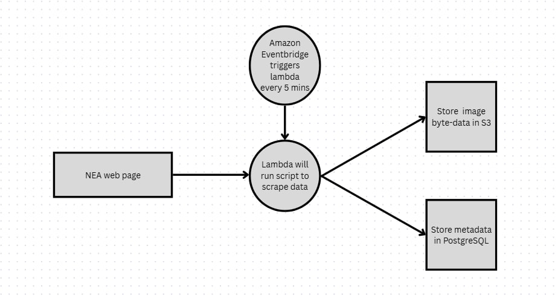
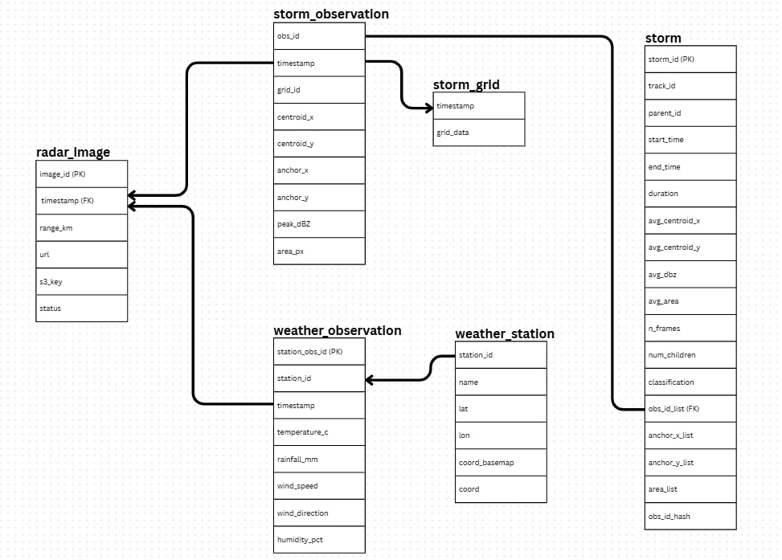

# Feature development

There were 3 main parts to the backend feature development: data ingestion, data processing and storm detection logic. These have been segmented into subfolders for organisation, each with their own detailed readme.md.

A PostgreSQL server hosted on AWS was used as our database, where our downstream Flask App drew from to provide the frontend team with the data to be displayed on the final weather application. The data-flow diagram (DFD) and entity-relationship (ER) diagram are included below. 

## DFD diagram

## ER diagram

